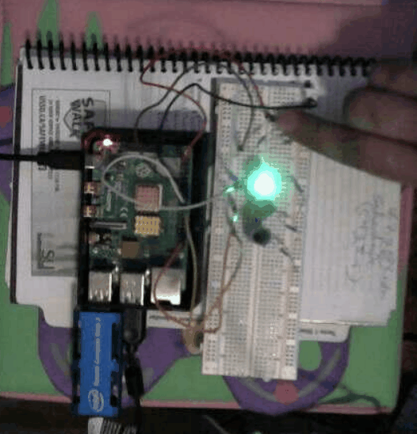
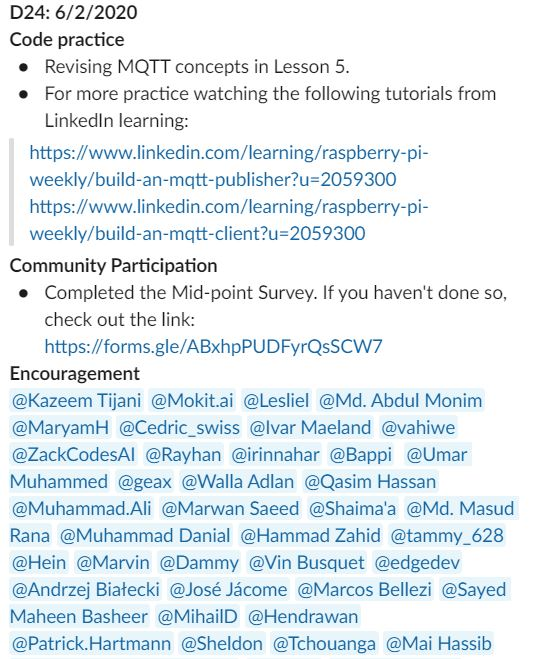
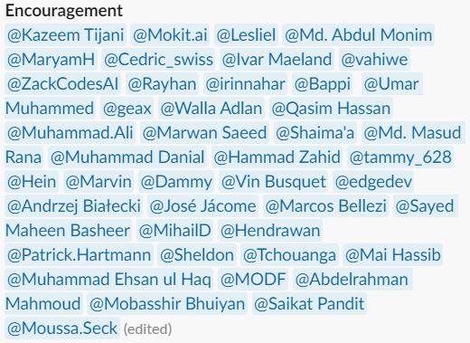

# Intel Edge AI Challenge

## 30 Days Udacity

### Daily Updates

- [Day01](#day1) [Day02](#day2) [Day03](#day3) [Day04](#day4) [Day05](#day5) [Day06](#day6) [Day07](#day7) [Day08](#day8) [Day09](#day9) [Day10](#day10) 
- [Day11](#day11) [Day12](#day12) [Day13](#day13) [Day14](#day14) [Day15](#day15) [Day16](#day16) [Day17](#day17) [Day18](#day18) [Day19](#day19) [Day20](#day20)
- [Day21](#day21) [Day22](#day22) [Day23](#day23) [Day24](#day24) [Day25](#day25) [Day26](#day26) [Day27](#day27) [Day28](#day28) [Day29](#day29) [Day30](#day30)
- [Day31](#day31) 
<!--- [Day32](#day32) [Day33](#day33) [Day34](#day34) [Day35](#day35) [Day36](#day36) [Day37](#day37) [Day38](#day38) [Day39](#day39) [Day40](#day40)
- [Day41](#day41)[Day42](#day42) [Day43](#day43) [Day44](#day44) [Day45](#day45) [Day46](#day46) [Day47](#day47) [Day48](#day48) [Day49](#day49) [Day50](#day50)--->
***
### Day01

[Back to Top](#top)

*** 
### Day02

[Back to Top](#top)

*** 
### Day03

[Back to Top](#top)

*** 
### Day04

[Back to Top](#top)

*** 
### Day05

[Raspberry PI:GPIO](images/day5b.pdf)

[Back to Top](#top)

*** 
### Day06

[Back to Top](#top)

*** 
### Day07

[Back to Top](#top)

*** 
### Day08

[Back to Top](#top)

*** 
### Day09

[Back to Top](#top)

*** 
### Day10

[Back to Top](#top)

*** 
### Day11

[Back to Top](#top)

*** 
### Day12

[Back to Top](#top)

*** 
### Day13

[Back to Top](#top)

*** 
### Day14

[Back to Top](#top)

*** 
### Day15

[Back to Top](#top)

*** 
### Day16

[Back to Top](#top)

*** 
### Day17

[Back to Top](#top)

*** 
### Day18

[Back to Top](#top)

*** 
### Day19

[Back to Top](#top)

*** 
### Day20

[Back to Top](#top)

***
### Day21

[Back to Top](#top)

*** 
### Day22

[Back to Top](#top)

*** 
### Day23

[Back to Top](#top)

*** 
### Day24

[Back to Top](#top)

*** 
### Day25

[Back to Top](#top)

*** 
### Day26

[Introduction to Deep Learning with OpenCV](images/day26f.pdf)

[Back to Top](#top)

*** 
### Day27

[Back to Top](#top)

*** 
### Day28

[Back to Top](#top)

*** 
### Day29

[Back to Top](#top)

*** 
### Day30

[Node.js Essential Training](images/day30c.pdf)

[Back to Top](#top)

***
### Day31

[Learning npm the Node Package Manager](images/day31.odf)

[Back to Top](#top)

*** 